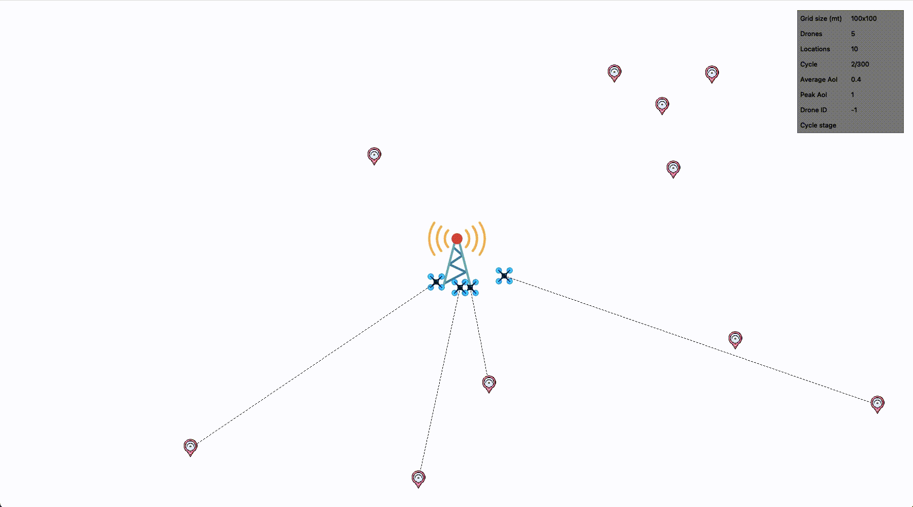

# Distributed UAV RL Protocol

[](https://colab.research.google.com/github/AlessioLuciani/distributed-uav-rl-protocol)

An implementation of a distributed protocol for cooperative sensing and sending operations of Unmanned Aerial Vehicles (UAVs) [1]. It is built on top of [TensorFlow Agents](https://www.tensorflow.org/agents) and uses reinforcement learning techniques (e.g. Deep Q-Learning, Actor-Critic) to compute ideal trajectories.

## Install dependencies
- Download and install [Miniconda](https://docs.conda.io/en/latest/miniconda.html)
- Run ```conda env create -f environment.yml```
- Run ```conda activate durp```
- That's it!

## Run the simulation
We also developed a simple GUI using the [PyQt5 library](https://www.riverbankcomputing.com/software/pyqt/) to test the effects of applying different scenarios on the simulation. To run it, launch the simulator from the project directory with default arguments using:

```shell
./simulation.py
```
or to see the list of available options run:

```shell
./simulation.py --help
```

## Simulator preview



## Images credits
Icons made by <a href="https://www.freepik.com" title="Freepik">Freepik</a>, <a href="https://www.flaticon.com/authors/photo3idea-studio" title="photo3idea_studio">photo3idea_studio</a>, and <a href="https://www.flaticon.com/authors/roundicons" title="Roundicons">Roundicons</a> from <a href="https://www.flaticon.com/" title="Flaticon">www.flaticon.com</a>

## References
[1] Jingzhi Hu, Hongliang Zhang, Lingyang Song, Robert Schober, & H. Vincent Poor. (2020). Cooperative Internet of UAVs: Distributed Trajectory Design by Multi-agent Deep Reinforcement Learning.
